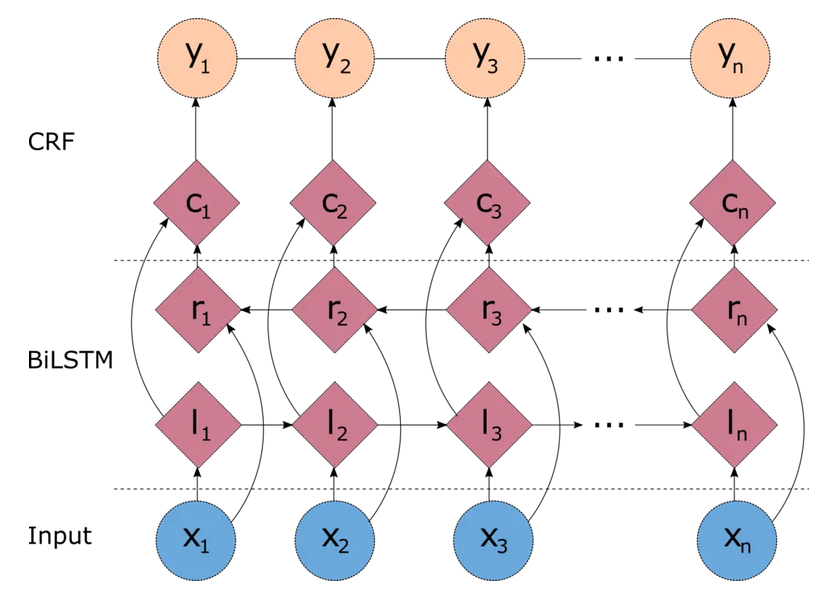

# LM Without Entity Knowledge

# Project Purpose

We want to investigate LM trained on anonymized data(without entities) can perform comparable as standard LM trained.

# Methodoly

In order to realize this study, we have followed the differents sets.

- Collect data inorder to pretrain a model : CNN and Daily mail 
- Anonymized the dataset with NER model by detecting enties and replaced them with placeholder
- Train a tokenizer in our case we have chosen a Unigram Tokenizer
- Select the transformer architecture
- Pretrain the model by choosing adapt hyperparameter for a good training and convergence
- Fine- Tune the model without entity on task who doesn't require entity knowledge like Glue benchmark an Question answering (Squad v1)

# Pretraining model

  

## Data for pretraining
The CNN Daily dataset [available here](https://huggingface.co/datasets/abisee/cnn_dailymail?row=26) is a rich collection of diverse news articles covering various topics, offering complex linguistic structures and named entities. It is highly valuable for training language models to perform tasks like summarization, question answering, and information extraction, as it mirrors real-world language use.

## Data preprocessing : Dataset Anonymisation
 
In our case we have chosen the **Flair NER model** [available here](https://huggingface.co/flair/ner-english-ontonotes-large) which employs stacked Bidirectional Long Short-Term Memory (BiLSTM) networks to capture long-range dependencies in both forward and backward directions, which enhances the model’s contextual understanding . Finally, the incorporation of a Conditional Random Field (CRF) layer at the end allows the model to capture
sequence-level tag dependencies, ensuring that the predicted labels form a valid sequence consistent with the training data

  

Specifically, when the Named Entity Recognition (NER) process identifies an entity $\( e_i \)$ within a document, it is replaced as follows:

$$
\begin{equation}
f(e_i) = \text{"ent"} + ID(e_i),
\end{equation}
$$

where $\( e_i \)$ is the identified entity in the document and $\( ID(e_i) \)$ is a unique integer assigned to $\( e_i \)$ within that document.

## Training Unigram tokenizer

The Unigram model aims to find a vocabulary $\( V \)$ and subword sequence $\( s = (s_1, s_2, \dots, s_n) \)$ for a given input text $\( T \)$ that maximizes the likelihood:

$$
\begin{equation}
P(T) = \prod_{i=1}^{n} P(s_i),
\end{equation}
$$

where $\( P(s_i) \)$ is the probability of the subword unit $\( s_i \)$.

## GPT2 architecture

The GPT-2 model consists of several key components:

1. **Embedding Layer**: Transforms input tokens into continuous vector representations.
    - **Token Embeddings**: Each token $\( t_i \)$ is mapped to an embedding $\( \mathbf{e}_i \in \mathbb{R}^d \)$, where $\( d \)$ is the embedding dimension.
    - **Position Embeddings**: Adds positional information to the token embeddings to retain the order of the sequence.

2. **Transformer Blocks**: Stacked layers consisting of:
    - **Masked Multi-Head Self-Attention**: Allows the model to focus on different parts of the input sequence when predicting a token, using multiple attention heads.

    $
    \text{Attention}(Q, K, V) = \text{softmax}\left( \frac{QK^\top}{\sqrt{d_k}} \right) V,
    $

    where $\( Q, K, V \)$ are the queries, keys, and values, respectively.

    - **Feed-Forward Neural Network (FFN)**: Applies two linear transformations with a non-linear activation in between, typically the Gaussian Error Linear Unit (GELU).
    
    $
    \text{FFN}(x) = \text{GELU}(xW_1 + b_1)W_2 + b_2
    $

    Where $\( W_1, b_1, W_2 \)$, and $\( b_2 \)$ are the weight matrices and bias vectors for the first and second linear transformations, and $\( x \)$ is the input to the feed-forward network.

    - **Layer Normalization**: Normalizes inputs to each sub-layer to stabilize and accelerate training.

3. **Output Layer**: Projects the hidden states back to the token vocabulary space to predict the next token.

  

##  Fine Tune the model 

| **Task**                 | **Metric**                   | **Baseline** | **Standard Model** | **Without Entity Model** |
|--------------------------|------------------------------|--------------|-------------------|--------------------------|
| **Single-Sentence Tasks** |                              |              |                   |                          |
| COLA                     | Matthews Corr.               | 33.6         | 38.0              | **36.0**                 |
| SST-2                    | Accuracy                     | 90.4         | 92.0              | **91.0**                 |
| **Similarity and Paraphrase Tasks** |                    |              |                   |                          |
| MRPC                     | Accuracy / F1                | 78.0 / 84.4  | 82.0 / 88.0       | **81.0 / 87.0**          |
| STS-B                    | Pearson / Spearman Corr.      | 74.2 / 72.3  | 87.0 / 87.0       | **83.0 / 83.0**          |
| **Inference Tasks**       |                              |              |                   |                          |
| RTE                      | Accuracy                     | 58.9         | 67.0              | **64.0**                 |
| WNLI                     | Accuracy                     | 65.1         | 56.0              | **56.0**                 |
| **Question Answering Tasks** |                         |              |                   |                          |
| SQuAD                    | Exact Match                  | 53.2         | 59.0              | **54.0**                 |
|                          | F1 Score                     | 65.03        | 70.0              | **61.0**                 |
